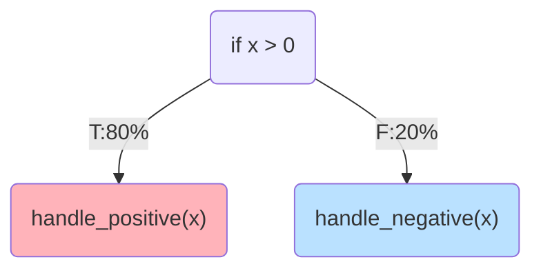
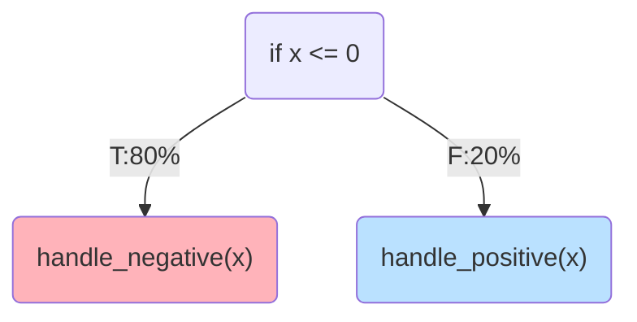

## Robustifying Profile Information Propagation in Profile-Guided Optimization

<div class="absolute bottom-0 right-0">
    
</div>

<div class="flex items-center mt-20px" style="gap:50px">
<span>
    Nicholas Montana - PhD Admission Interview
</span>
</div>

<SlideCurrentNo class="absolute top-5 right-10" style="opacity:50%"/>

<!--
I'm here to present my proposal on a problem that arise in advanced optimization scenarios
-->

---

# Who Am I ?

<v-clicks depth=2>

- Cybersecurity background
  - Cyberchallenge.it 2024 finalist
  - Capture-the-Flag player at the official Sapienza CTF team
- Contributed to the LLVM compiler infrastructure by reporting undiscovered bugs 

</v-clicks>

<div class="flex flex-row justify-center align-center mt-50px gap-50px">
  =2" src="/public/images/cyberchallenge.png" width="20%">
  =3" src="/public/images/trx.png" width="20%">
  =4" src="/public/images/llvm.jpg" width="20%">
</div>

<SlideCurrentNo class="absolute top-5 right-10" style="opacity:50%"/>

<!--
Over the past two years, I have built a strong background in cybersecurity by completing my Master's degree in Cybersecurity.
During this time, I also took part 
- in the CyberChallenge program, where I reached the final Attack & Defense competition,
- I also participated in several online Capture The Flag competitions as a member of TRX, Sapienza's official CTF team.

Although my primary focus was cybersecurity initially, my Master's thesis introduced me to the field of compilers, which became a strong research interest for me.
As a result of my thesis, I contributed to the LLVM compiler infrastructure by identifying and reporting several previously undiscovered bugs.
-->

---

# Performance is Critical

<v-clicks>

- Achieving optimal performance is of critical importance today.
  - Small performance improvement can bring substantial economical saving for warehouse-scale deployments.
- **Profile-Guided Optimization** tailors compiler optimizations to the application's measured workload.
  - **Profile** = Execution frequencies of program regions
  - Enables more informed optimization decisions based on real execution behavior.
  - Particularly effective for **performance-critical applications** where representative profiles can be collected.

</v-clicks>

<SlideCurrentNo class="absolute top-5 right-10" style="opacity:50%"/>

<!--
1. Today, **software performance** is more important than ever.
In **large warehouse-scale deployments**, even a small performance improvement can **translate** into significant savings in infrastructure and operating costs.
2. One of the most effective techniques for improving performance is **Profile-Guided Optimization**, or PGO.
3. The main idea behind PGO is very simple: instead of optimizing the program just by relying on **general heuristics**, the compiler **tailors** the optimization process to the way the application actually behaves during execution.
4. To do this, it relies on a **profile**, which records how frequently different parts of the program are executed under a representative workload.
This information allows the compiler to make more informed optimization decisions based on the application's real execution behavior.
5. Because of this, PGO is particularly **attractive** for **performance-critical** applications, where representative execution profiles can be collected and the additional optimization effort is well justified.
-->

---

# Profile-Guided Optimization

<div class="flex justify-center align-center mt-60px">
<v-clicks>

  <div v-show="$clicks === 1" >
      
  </div>
  <div v-show="$clicks === 2">
      
  </div>
  <div v-show="$clicks === 3">
      
  </div>
  <div v-show="$clicks === 4">
      
  </div>
  <div v-show="$clicks === 5">
      
  </div>

</v-clicks>

</div>

<SlideCurrentNo class="absolute top-5 right-10" style="opacity:50%"/>

<!--
The PGO workflow can be divided into three main stages.
1. First, the source program is compiled in an **initial build phase**, producing a binary instrumented or prepared for profile collection.
2. This binary is then **executed under a representative workload**, during which profile data is collected to capture the program's execution behavior.
3. Finally, the collected profile information is fed back to the compiler together with the original source code. The compiler uses this information to **guide optimization decisions** and generate a more efficient binary **tailored to the target workload**.
-->

---

# Profile Life-cycle

<v-clicks depth=2>

- Within the PGO workflow, profiles go through three main phases.
  - **Collection:** **execution behavior** is measured on a representative workload.
  - **Mapping:** profile information is associated with the corresponding program constructs as **metadata**.
  - **Usage:** the compiler uses this metadata to guide **optimization decisions**.

</v-clicks>

<div v-show="$clicks === 2" class="flex justify-center align-items mt-20px">
  
</div>
<div v-show="$clicks === 3" class="flex justify-center align-items mt-20px">
  
</div>
<div v-show="$clicks === 4" class="flex justify-center align-items mt-20px">
  
</div>

<SlideCurrentNo class="absolute top-5 right-10" style="opacity:50%"/>

<!--
Looking at the PGO workflow we can isolate three main phases of the profile life-cycle: 
1. The first is **collection**, where the execution behavior of the application is measured while running a representative workload.
2. The second is **mapping**. Here, the collected profile information is associated with the corresponding program constructs as metadata. Examples of such metadata are information about how many times a function was invoked or how many times a branch was taken.
3. Finally, we have **usage**, where the compiler relies on this metadata to guide its optimization decisions and generate more efficient code.
-->

---

# Practical Obstacles

- For an ideal PGO application

<Highlight class="mt-20px mb-20px">

Profile must be **complete** and **accurate** in each phase of its life-cycle

</Highlight>

<v-clicks>

- Inaccurate profiles may lead the compiler to make suboptimal optimizations.
- In practice, each phase hides sources of inaccuracies
  - **Sampling** strategies are inaccurate by nature
  - The dynamic nature of software leads to **stale profiles**
  - Optimization contain errors in **metadata propagation** logic

</v-clicks>

<SlideCurrentNo class="absolute top-5 right-10" style="opacity:50%"/>

<!--
1. Now, ideally the profile should remain both **complete** and **accurate** throughout its entire life cycle.
By *accurate*, I mean that it should faithfully represent how the application behaves under its target workload.
2. Otherwise, the compiler may make optimization decisions based on **misleading information**, resulting in less efficient code.

In practice, however, every phase of the profile life cycle can introduce inaccuracies.
- Profiles can be collected via a sampling strategy, which is **inherently an approximation** and therefore cannot capture the program's behavior perfectly.
- Over time, profiles can also become **stale**. As software evolves, a profile collected for one version of the program may no longer accurately represent a newer version, reducing its usefulness.
- Finally, inaccuracies can also be introduced during **optimization** itself. As compiler optimization transform the program, they must **update the associated profile metadata** to keep it consistent with the transformed code.
**If this propagation is incorrect**, subsequent optimizations will rely on inaccurate profile information, even if the original profile was perfectly accurate.
-->

---

# State of the Art

<v-clicks depth=2>

- Significant research effort has addressed these challenges.
  - [^profi] Rectifies inaccuracies introduced by **sampling**.
  - [^stale] Adapts **stale profiles** to newer versions of a program.
  - [^propagation], [^unittesting] Started addressing errors in **profile metadata propagation**, but only partially.

</v-clicks>

[^profi]: Wenlei He, Julián Mestre, Sergey Pupyrev, Lei Wang, and Hongtao Yu. “Profile inference revisited”.
[^stale]: Amir Ayupov, Maksim Panchenko, and Sergey Pupyrev. “Stale Profile Matching”.
[^propagation]: Youfeng Wu. “Accuracy of Profile Maintenance in Optimizing Compilers”.
[^unittesting]: Profile Information Propagation Unittesting: https://discourse.llvm.org/t/rfc-profile-information-propagation-unittesting/73595

<SlideCurrentNo class="absolute top-5 right-10" style="opacity:50%"/>

<!--
Several research efforts have tackled the sources of inaccuracies we have just discussed.

- The first work proposes a technique to improve the accuracy of sampled profiles.
- The second work adapts profiles so that they can still be used after the software evolves.

The last two works started exploring the problem of **profile metadata propagation** during optimization.

- The first work highlights that optimizations may fail to preserve profile information correctly.
- The second work introduces a practical approach to detect cases where metadata is accidentally lost during optimizations.

However, these approaches do not fully address the problem.

- The first work does not provide a systematic way to identify which optimizations are responsible for profile propagation errors.
- The second work focuses only on cases where metadata is lost, but does not address the more challenging scenario where metadata is preserved but becomes **incorrect** after a transformation.

Overall, the problem of ensuring profile propagation correctness remains largely unexplored, despite its importance for the reliability of Profile-Guided Optimization.
-->

---

# Example of Profile Mishandling

<div style="display:flex; flex-direction:row; justify-content:space-evenly; align-items:center; height:80%;">

<div style="display:flex; flex-direction:column; justify-content:space-evenly; align-items:center;">

```c {all}{class:'!children:text-[15px]'}
// Before pass
if (x > 0) { // Then branch taken 80 times
    handle_positive(x) 🔥
} else { // Else branch taken 20 times
    handle_negative(x) ❄️
}
```



</div>

<div v-click style="display:flex; flex-direction:column; justify-content:space-evenly; align-items:center;" >

```c {all}{class:'!children:text-[15px]'}
// After pass
if (x <= 0) { // Then branch taken 80 times
    handle_negative(x) 🔥
} else { // Else branch taken 20 times
    handle_positive(x) ❄️
}
```



</div>
</div>

<SlideCurrentNo class="absolute top-5 right-10" style="opacity:50%"/>

<!--
To better understand the problem, let's look at a simple example.

Consider this C code snippet, which checks whether `x` is greater than zero. If the condition is true, it calls `handle_positive`; otherwise, it calls `handle_negative`.

Now suppose the program has an associated profile indicating that the *then* branch is executed 80 times, while the *else* branch is executed only 20 times. Based on this information, the compiler identifies `handle_positive` as the hot path and prioritizes it during optimization.

Next, imagine a fictional optimization pass that simply flips the condition of the `if` statement. The transformed program remains semantically equivalent because the contents of the two branches are swapped accordingly. However, the optimization forgets to update the associated profile.

As a result, the profile no longer matches the transformed program. The compiler now incorrectly believes that `handle_negative` is the hot path and optimizes for the wrong execution scenario, ultimately producing a less efficient binary.
-->

---

# Profile Mishandling Research Gap

<v-clicks>

- Recent studies have linked performance regressions to **incorrect profile propagation**. [^regressions]
- It can **undermine** the benefits of accurate profile collection and adaptation.
- Ensuring correct profile propagation is **non-trivial**.
  - There is no obvious correlation between the original and transformed code.
  - Compiler optimizations **interact**, so testing them in isolation is not enough.
  - There are **no dedicated tools** to validate profile propagation.

</v-clicks>


<Highlight v-click class="mt-10px mb-10px">

Profile information is **transformed** together with the program, but its correctness cannot be directly observed.

</Highlight>

<SlideCurrentNo class="absolute top-5 right-10" style="opacity:50%"/>

[^regressions]: Performance Regression in LLVM - A SPEC CPU 2017 Study: https://discourse.llvm.org/t/performance-regression-in-llvm-a-spec-cpu-2017-study/84812

<!--
Studying this problem is very important, in fact:  
- Recent studies have shown that some performance regressions can be traced back to incorrect profile propagation during compilation.
- The benefits of all the effort spent collecting and improving the profile can be progressively lost as the optimization pipeline executes.

Addressing this problem, however, is far from straightforward.

- When compiler optimization transform the program, there is often no direct correspondence between the original code and the transformed code, making it difficult to determine how profile information should be updated.
- Moreover, optimizations interact with one another, so an incorrect update performed by one pass can affect all subsequent optimization.
- There are currently no dedicated tools to systematically verify that profile information is propagated correctly throughout the optimization pipeline.

So to summarize the problem: Profile information is transformed together with the program, but its correctness cannot be directly observed.
-->

---

# Research Proposal

<Highlight color="#ffdfba" icon="/public/images/question.svg" class="mt-10px mb-10px">

Can profile propagation accuracy be assessed systematically?

</Highlight>

<v-clicks>

- A framework to systematically validate profile propagation.
  - Generate **synthetic test programs** with automatically verifiable profile behavior.
  - Drive test generation using **coverage-guided techniques** to exercise profile propagation logic.
- Expected scientific contributions
  - A methodology to systematically assess profile propagation correctness.
  - A coverage-guided testing strategy for improving the validation of profile propagation.

</v-clicks>

<SlideCurrentNo class="absolute top-5 right-10" style="opacity:50%"/>

<!--
This brings me to the central research question of my proposal: Can profile propagation accuracy be assessed systematically?

To answer this question, I propose to develop a framework for validating profile propagation throughout the optimization pipeline.

- The first research direction is the generation of synthetic test programs whose expected profile behavior can be automatically verified after compiler transformations.
- The second direction builds on this idea by using coverage-guided testing to automatically generate and prioritize tests that exercise as much profile propagation logic as possible.

Together, these two directions lead to two main scientific contributions:
- a methodology for systematically assessing profile propagation correctness,
- and a novel coverage-guided testing strategy specifically designed to improve the validation of profile propagation.
-->

---

# Stress-Test approach

<v-clicks depth=2>

- Stress-test profile propagation using **synthetic test programs**
  - Generate structurally complex programs using **off-the-shelf** test generators.
  - Optimize them with PGO and construct the **ground-truth profile**.
  - Compare the propagated profile against the ground truth for **validation**.

</v-clicks>

<div v-show="$clicks === 1" class="flex justify-center align-items mt-20px mb-20px ">
  
</div>
<div v-show="$clicks === 2" class="flex justify-center align-items mt-20px mb-20px ">
  
</div>
<div v-show="$clicks === 3" class="flex justify-center align-items mt-20px mb-20px">
  
</div>
<div v-show="$clicks >= 4" class="flex justify-center align-items mt-20px mb-20px">
  
</div>

<v-clicks>

- Automated **bug triaging** to identify the responsible compiler component.
- Preliminary results: **multiple confirmed LLVM bugs**, among the first reported for profile propagation.

</v-clicks>

<SlideCurrentNo class="absolute top-5 right-10" style="opacity:50%"/>

<!--
The first research direction builds upon the work I started during my Master's thesis.

1. The idea is to stress-test profile propagation using automatically generated **synthetic test programs**.
2. For each generated program, the compiler first performs Profile-Guided Optimization, producing a profile that has been propagated throughout the optimization pipeline.
3. Then, instead of trusting that propagated profile, we independently execute the optimized program to reconstruct its actual execution profile. This gives us a **ground truth** describing how the transformed program really behaves.
4. Finally, we compare this ground truth with the profile propagated by the compiler. Any discrepancy indicates that profile information was not propagated correctly during optimization.

Since this process can uncover a large number of issues, the framework also requires an automated triaging mechanism to identify which compiler transformation is responsible for introducing each propagation error.

I have already prototyped this approach during my Master's thesis, where it led to the discovery of several previously unknown profile propagation bugs in LLVM.
These bugs were confirmed by the LLVM developers and, to the best of my knowledge, were among the first reported specifically for profile propagation, providing encouraging evidence of the effectiveness of this methodology.
-->

---

# Coverage-Guided Testing 

<v-clicks depth=2>

- Extend the stress-test approach with **coverage-guided testing**
  - Start from existing compiler **test suites**.
  - Apply classic code mutations and **novel profile-aware mutations**.
  - Guide mutations using a **coverage metric** targeting profile propagation logic.
  - Validate propagated profiles to detect profile mishandling.

</v-clicks>

<div v-show="$clicks === 1" class="flex justify-center align-items mt-20px mb-20px">
  
</div>
<div v-show="$clicks === 2" class="flex justify-center align-items mt-20px mb-20px">
  
</div>
<div v-show="$clicks === 3" class="flex justify-center align-items mt-20px mb-20px">
  
</div>
<div v-show="$clicks === 4" class="flex justify-center align-items mt-20px mb-20px">
  
</div>
<div v-show="$clicks >= 5" class="flex justify-center align-items mt-20px mb-20px">
  
</div>

<v-click>

- Enables exploration of **previously untested** profile propagation logic.

</v-click>

<SlideCurrentNo class="absolute top-5 right-10" style="opacity:50%"/>

<!--
While the stress-test approach is effective, its coverage ultimately depends on the complexity of the generated synthetic programs.
To overcome this limitation, I propose a second, complementary research direction based on coverage-guided testing.

The idea is inspired by existing compiler testing methodologies, where a set of carefully designed test programs serves as a starting point.

1. Rather than generating programs from scratch, these existing tests are automatically mutated to explore new compiler behaviors.
2. In my case, I plan to combine traditional code mutations with novel profile-aware mutation strategies, specifically designed to exercise profile propagation logic.
3. The mutations are guided by a dedicated coverage metric, implemented by instrumenting the compiler, that measures how much of the profile propagation logic has been exercised.
This allows the framework to continuously generate new tests that target previously unexplored behaviors.
4. The resulting test cases are then validated using the same profile validation methodology introduced in the previous approach.

Beyond improving the validation of profile propagation, this methodology could also provide a foundation for applying coverage-guided testing to other compiler testing problems.
-->

---

# Evaluation of the Proposed Directions

<v-clicks depth=2>

- **LLVM** compiler infrastructure as evaluation target
- Evaluate whether the proposed methodologies can:
  - Detect new **profile mishandling bugs**.
  - Identify bugs with a measurable **performance impact**.
  - Improve the exploration of LLVM's **profile propagation logic**.

</v-clicks>

<div class="flex flex-row justify-center align-center gap-20px mt-70px mb-20px">

  <Card v-show="$clicks>=3" content="🕸️Bugs" color="none"/> 
  <Card v-show="$clicks>=4" content="⚡Performance" color="none" />
  <Card v-show="$clicks>=5" content="🧭Coverage" color="none" />

</div>

<SlideCurrentNo class="absolute top-5 right-10" style="opacity:50%"/>

<!--
The proposed methodologies will be evaluated on the **LLVM compiler infrastructure**.

LLVM is a widely adopted compiler framework, used in industrial environments by companies such as Google and Apple, while also being extensively used by researchers and the open-source community to develop and evaluate new compiler techniques.

The evaluation will focus on three main aspects.

- First, whether the proposed approaches can discover new **profile mishandling bugs** in LLVM.
- Second, whether fixing these issues leads to a measurable improvement in the performance of the generated binaries.
- Finally, whether the proposed testing methodologies can improve the exploration of profile propagation logic, allowing us to exercise compiler behaviors that are otherwise difficult to reach.
-->

---

# Impacts and Benefits

<v-clicks>

- **Analysis tools** to help compiler developers assess and improve PGO implementations.
- **More effective PGO** leading to faster binaries and reduced execution costs.

</v-clicks>

<div class="flex flex-row justify-center align-center gap-20px mt-70px mb-20px">

  <Card v-show="$clicks>=1" content="🛠️Analysis Tools" color="none" width=""/> 
  <Card v-show="$clicks>=2" content="🚀Faster Binaries" color="none" width=""/>
  <Card v-show="$clicks>=2" content="🌱Energy Savings" color="none" width=""/>

</div>

<SlideCurrentNo class="absolute top-5 right-10" style="opacity:50%"/>

<!--
The expected impact of this research is twofold.

- First, it will provide compiler developers with new analysis tools to assess the correctness of their PGO implementations and identify potential profile propagation issues.
- Second, by improving the reliability of profile-guided optimization, this work can enable more effective optimized binaries.
This translates into performance improvements for users and, especially in large-scale deployments, can provide both economic benefits through reduced computational costs and environmental benefits through improved energy efficiency.

Moreover, this research direction is aligned with industrial interests, as the reliability and effectiveness of PGO are relevant topics also explored in collaboration between academic and industrial partners, including Google.
-->

---

# Takeaway

<v-clicks>

- **Problem**:

  <Highlight iconwidth="0px" class="mb-10px">

  Profile propagation is **not reliably** validated

  </Highlight>

- **Proposal**:

  <Highlight color="#ffdfba" iconwidth="0px" class="mb-10px">

    - Stress-testing via **synthetic test**
    - **Coverage-guided exploration** of the compiler
    - **Automated validation** of profile correctness

  </Highlight>

- **Contribution**:

  <Highlight color="#baffc9" iconwidth="0px" class="mb-10px">

  **Better** optimizations and **improved** compiler coverage

  </Highlight>

</v-clicks>

<!--
Based on discussions with LLVM developers, profile propagation validation is currently performed in a best-effort manner, or in some cases not systematically performed, due to the lack of dedicated mechanisms to verify it.
-->
