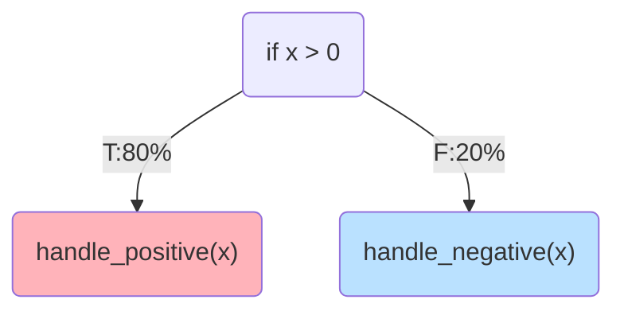
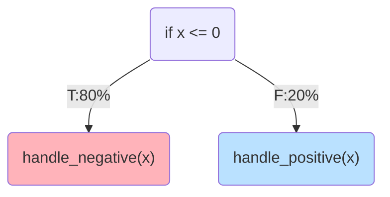

## Robustifying Profile Information Propagation in Profile-Guided Optimization

<div class="absolute bottom-0 right-0">
    
</div>

<div class="flex items-center mt-20px" style="gap:50px">
<span>
    Nicholas Montana
</span>
</div>

<SlideCurrentNo class="absolute top-5 right-10" style="opacity:50%"/>

---

# Who Am I ?

<v-clicks>

- Cyberchallenge.it 2024 finalist
- Capture-the-Flag player at the official Sapienza CTF team
- Contributed to the LLVM compiler infrastructure by reporting undiscovered bugs 

</v-clicks>

<div class="flex flex-row justify-center align-center mt-50px gap-50px">
  =1" src="/public/images/cyberchallenge.png" width="20%">
  =2" src="/public/images/trx.png" width="20%">
  =3" src="/public/images/llvm.jpg" width="20%">
</div>

<SlideCurrentNo class="absolute top-5 right-10" style="opacity:50%"/>

<!--
- I am very passionate cybersecurity and computer science.
- I participated in the cyberchallenge program, reaching the final attack and defense competition.
- I participated at various online CTF challenges together with the TRX team, which is the official sapienza CTF team.
- I contributed to the LLVM compiler infrastructure by submitting reports of previously undiscovered bugs as part of my master thesis work.
-->

---

# Performance is Critical

<v-clicks>

- Achieving optimal performance is of critical importance today.
  - A 1% performance improvement can save millions of dollars annually in large-scale deployments.
- **Profile-Guided Optimization** is a way to achieve great performance
  - Optimization process **tailored** to the workload of the compiled program
  - **Profile** = Execution frequencies of program regions
  - Eliminates the need to infer such information
  - Perfect for high-load applications

</v-clicks>

<SlideCurrentNo class="absolute top-5 right-10" style="opacity:50%"/>

<!--
- As of today, performance is a crucial property of software. For large scale applications
even a 1% performance improvement can save millions of dollars annually.

- Profile-Guided Optimization, among other optimization strategies, stands-out for achieving great performance.
- The idea behind it is the tailoring of the optimization process around the workload of the application
- It does so by using a profile for the application, which represents the execution frequencies of program regions
- This eliminates the need to infer such information, which were computed by classical optimization in order to take decisions
- It is perfect for high-load applications, since complete and robust profiles can be collected
-->

---

# Profile-Guided Optimization

<div class="flex justify-center align-center mt-60px">
<v-clicks>

  <div v-show="$clicks === 1" >
      
  </div>
  <div v-show="$clicks === 2">
      
  </div>
  <div v-show="$clicks === 3">
      
  </div>
  <div v-show="$clicks === 4">
      
  </div>
  <div v-show="$clicks === 5">
      
  </div>

</v-clicks>

</div>

<SlideCurrentNo class="absolute top-5 right-10" style="opacity:50%"/>

---

# Profile Life-cycle

<v-clicks depth=2>

- Profiles traverse three main phases within the PGO workflow
  - **Collection**: The profile is collected and persisted as a file
  - **Mapping**: The profile is represented as **metadata** attached to program constructs
  - **Usage**: The metadata is used to guide optimizing transformations

</v-clicks>

<div v-show="$clicks === 2" class="flex justify-center align-items mt-20px">
  
</div>
<div v-show="$clicks === 3" class="flex justify-center align-items mt-20px">
  
</div>
<div v-show="$clicks === 4" class="flex justify-center align-items mt-20px">
  
</div>

<SlideCurrentNo class="absolute top-5 right-10" style="opacity:50%"/>

<!--
Looking at the PGO workflow, we can isolate three main phases of the profile life-cycle
- Collection, where the profile is collected and persisted as a file for later usage. 
- Mapping, in which the profile file is read and profile metadata is generated and attached to program constructs
- Usage, where the program associated with profile metadata is optimized and the profile is used to guide optimization decisions
-->

---

# Practical Obstacles

- For an ideal PGO application

<Highlight class="mt-20px mb-20px">

Profile must be **complete** and **accurate** in each phase of its life-cycle

</Highlight>

<v-clicks>

- Inaccurate profiles may lead the compiler to make suboptimal optimizations.
- In practice, each phase hides sources of inaccuracies
  - **Sampling** strategies are inaccurate by nature
  - The dynamic nature of software leads to **stale profiles**
  - Optimizing passes contain errors in **metadata propagation** logic

</v-clicks>

<SlideCurrentNo class="absolute top-5 right-10" style="opacity:50%"/>

<!--
There are some practical obstacles when applying PGO. For an ideal PGO application:
The profile must be complete and accurate in each phase of its life-cycle

By **accurate** I mean that the profile has to accurately reflect the actual workload experienced by the binary when executed in the production environment.
Indeed inaccurate profiles could result in bad optimization decisions, leading ultimately to a sub-optimal program generation.

Nevertheless, in practice some sources of inaccuracies are hidden within the PGO workflow itself
- Sampling collection strategies are inaccurate by nature, leading to inaccurate profiles collected
- The dynamic nature of software leads to stale profiles. Before we assumed that the program version on which we collected the profile is the same as the program version on which we want to use the profile.
In practice this rarely happens, and the structural mismatch between the two versions make some part of the profile unusable.
- Finally, optimization pipeline themselves need to carefully update profile metadata after code transformations, so that downstream passes could still benefit from an accurate profile.
-->

---

# State of the Art

<v-clicks depth=2>

- Lots of effort to solve these problems
  - [^profi] Proposes a rectification algorithm to rectify sampled profiles 
  - [^stale] Proposes an algorithm to adapt stale profiles to newer program versions 
  - [^propagation], [^unittesting] only partially address failures in metadata propagation

</v-clicks>

[^profi]: Wenlei He, Julián Mestre, Sergey Pupyrev, Lei Wang, and Hongtao Yu. “Profile inference revisited”.
[^stale]: Amir Ayupov, Maksim Panchenko, and Sergey Pupyrev. “Stale Profile Matching”.
[^propagation]: Youfeng Wu. “Accuracy of Profile Maintenance in Optimizing Compilers”.
[^unittesting]: Profile Information Propagation Unittesting: https://discourse.llvm.org/t/rfc-profile-information-propagation-unittesting/73595

<SlideCurrentNo class="absolute top-5 right-10" style="opacity:50%"/>

<!--
Lots of effort was put by researchers to smooth out inaccuracies introduced in those phases.
- The first work proposes an algorithm to rectify sampled profile by using flow-conservation rules
- The second work proposes an algorithm to adapt stale profile to newer versions of the program by structurally matching the two versions.
- The third work is a study on the scale of profile propagation errors within optimization pipelines and does not provide a way to asses profile correctness in practice.
- The fourth is a practical step towards the unit-testing of profile information, and proposes a way to understand if profile are dropped by optimization passes but does not provide a way to understand if wrong updates were made by them.
-->

---

# Example of Profile Mishandling

<div style="display:flex; flex-direction:row; justify-content:space-evenly; align-items:center; height:80%;">

<div style="display:flex; flex-direction:column; justify-content:space-evenly; align-items:center;">

```c{all}
// Before pass
if (x > 0) { // Then branch taken 80 times
    handle_positive(x) 🔥
} else { // Else branch taken 20 times
    handle_negative(x) ❄️
}
```



</div>

<div v-click style="display:flex; flex-direction:column; justify-content:space-evenly; align-items:center;" >

```c{all}
// After pass
if (x <= 0) { // Then branch taken 80 times
    handle_negative(x) 🔥
} else { // Else branch taken 20 times
    handle_positive(x) ❄️
}
```



</div>
</div>

<SlideCurrentNo class="absolute top-5 right-10" style="opacity:50%"/>

---

# Profile Mishandling Research Gap

<v-clicks>

- Recently discovered **regressions** could be attributed to profile mishandling
- Profile mishandling **nullifies** solutions for inaccuracies at earlier stages  
- **Non-trivial** solution
  - What does it mean to **correctly** propagate profiles?
  - **No correlation** between before and after code
  - **Interaction** between passes needs to be taken into account
  - **Static checks** on control-flow are not enough!
  - **No dedicated tools** to validate propagation logic

</v-clicks>

<Highlight v-click class="mt-10px mb-10px">

Profile information is **transformed** together with the program, but unlike the program itself, its correctness cannot be directly observed.

</Highlight>

<SlideCurrentNo class="absolute top-5 right-10" style="opacity:50%"/>

<!--
The problem of profile mishandling remains largely unstudied, even though solving it is of critical importance because:
- Recent insights shows that performance regressions could be attributed to profile mishandling
- Profile mishandling nullifies effort to correct profiles in earlier stages of the life-cycle, due to the profile degrading incrementally as the pipeline is applied
- Not so easy to spot profile propagation errors.
-->

---

# Research Proposal

<Highlight color="#ffdfba" icon="/public/images/question.svg" class="mt-10px mb-10px">

Can profile propagation accuracy be assessed systematically?

</Highlight>

<v-clicks>

- A methodological and practical framework to
  - Validate profile information propagation using **random** C programs
  - Improve the PGO logic coverage of the tested compiler via **coverage-guided** testing
- Expected scientific contributions
  - A methodology to systematically asses profile propagation correctness
  - A novel coverage-guided testing strategy targeting profile propagation logic

</v-clicks>

<SlideCurrentNo class="absolute top-5 right-10" style="opacity:50%"/>

<!--
So the research question I want to answer is: "Can profile propagation accuracy be assessed systematically?".

I intend to develop 2 research directions to answer this question:
- The validation of profile propagation logic using random C programs
- The coverage improvement of the tested compiler infrastructure, focusing on PGO specifically 

The resulting scientific contributions would be:
- A methodology to systematically asses profile propagation correctness
- A novel coverage-guided testing strategy targeting profile propagation logic
-->

---

# Stress-Test approach

<v-clicks depth=2>

- Stress-testing profile propagation logic with randomly generated programs
  - Uses **off-the-shelf** random program generators
  - Random program are optimized to get the **propagated profile**
  - Profile **validation** to spot profile mishandling

</v-clicks>

<div v-show="$clicks === 1" class="flex justify-center align-items mt-20px mb-20px ">
  
</div>
<div v-show="$clicks === 2" class="flex justify-center align-items mt-20px mb-20px ">
  
</div>
<div v-show="$clicks === 3" class="flex justify-center align-items mt-20px mb-20px">
  
</div>
<div v-show="$clicks >= 4" class="flex justify-center align-items mt-20px mb-20px">
  
</div>


<v-clicks>

- Automated **bug triaging** to classify the large number of issues
- Effectiveness is bounded by the **complexity** achievable by program generators

</v-clicks>

<SlideCurrentNo class="absolute top-5 right-10" style="opacity:50%"/>

<!--
The first direction I intend to explore is the usage of random programs. This direction 
- Uses off-the-shelf random program generators to generate structurally complex programs
- These programs are profiled and optimized obtaining the profile propagated by the compiler
- The propagated profile is validated to understand if profile propagation errors were made

The framework would include an automatic-bug triaging mechanism to minimize the manual effort needed to analyze the result.
The effectiveness of this methodology is bounded by the program complexity the generators can achieve. 
-->

---

# Coverage-Guided Testing 

<v-clicks depth=2>

- A deeper analysis approach, which uses 
  - **Test-suite** programs as a foundation
  - Classic code mutations and **novel** profile mutations strategies
  - **Novel Feedback** mechanism that defines a **coverage metric** to guide mutations
  - Profile **validation** to spot profile mishandling

</v-clicks>

<div v-show="$clicks === 1" class="flex justify-center align-items mt-20px mb-20px">
  
</div>
<div v-show="$clicks === 2" class="flex justify-center align-items mt-20px mb-20px">
  
</div>
<div v-show="$clicks === 3" class="flex justify-center align-items mt-20px mb-20px">
  
</div>
<div v-show="$clicks === 4" class="flex justify-center align-items mt-20px mb-20px">
  
</div>
<div v-show="$clicks >= 5" class="flex justify-center align-items mt-20px mb-20px">
  
</div>

<v-click>

- Exposes **untested** regions of the compiler to uncover deeper issues

</v-click>

<SlideCurrentNo class="absolute top-5 right-10" style="opacity:50%"/>

<!--
That's why I intend to explore a second direction by designing a novel coverage-guided mechanism which:
- Uses program drawn from existing test-suite as a foundation
- These programs would be mutated using code mutation strategies and novel profile mutation strategies
- The compiler would be instrumented in order to implement a lightweight feedback mechanism that instantiates a novel coverage metric to guide mutations
This second direction should improve the coverage of the tested compiler's profile propagation logic.
-->

---

# Evaluation of the Proposed Directions

<v-clicks depth=2>

- **LLVM** compiler infrastructure as evaluation target
- Can the proposed methodologies:
  - Find new **bugs**? If so, how many?
  - **Improve the performance** of the generated binaries?
  - Improve optimization pass coverage within LLVM?

</v-clicks>

<div class="flex flex-row justify-center align-center gap-20px mt-70px mb-20px">

  <Card v-show="$clicks>=3" content="🕸️Bugs" color="none"/> 
  <Card v-show="$clicks>=4" content="⚡Performance" color="none" />
  <Card v-show="$clicks>=5" content="🧭Coverage" color="none" />

</div>

<SlideCurrentNo class="absolute top-5 right-10" style="opacity:50%"/>

<!--
I will evaluate the proposed methodologies on the LLVM compiler infrastructure being open source but also used in industry.
The evaluation will be performed by checking if
- I can find new bugs, and if so how many. 
- Fixing those bugs lead to a performance improvement of generated binaries
- Code and profile mutations lead to an improvement in the coverage of optimization passes
-->

---

# Impacts and Benefits

<v-clicks>

- **Analysis tools** for compiler developers, to assess their PGO implementations
- **Faster** PGO binaries for the user
- **Energy savings** due to optimal binaries

</v-clicks>

<div class="flex flex-row justify-center align-center gap-20px mt-70px mb-20px">

  <Card v-show="$clicks>=1" content="🛠️Analysis Tools" color="none" width=""/> 
  <Card v-show="$clicks>=2" content="🚀Faster Binaries" color="none" width=""/>
  <Card v-show="$clicks>=3" content="🌱Energy Savings" color="none" width=""/>

</div>

<SlideCurrentNo class="absolute top-5 right-10" style="opacity:50%"/>

<!--
The final impacts of my research consist of
- New means for compiler developers to asses their PGO implementations
- Faster PGO binaries for the users
- Energy savings, thus reduced environmental footprint of large-scale applications
-->

---

# Takeaway

<v-clicks>

- **Problem**:

  <Highlight iconwidth="0px" class="mb-10px">

  Profile propagation is **not reliably** validated

  </Highlight>

- **Proposal**:

  <Highlight color="#ffdfba" iconwidth="0px" class="mb-10px">

    - Stress-testing via **random programs**
    - **Coverage-guided exploration** of compiler passes
    - **Automated validation** of profile correctness

  </Highlight>

- **Contribution**:

  <Highlight color="#baffc9" iconwidth="0px" class="mb-10px">

  **Better** optimizations and **improved** compiler coverage

  </Highlight>

</v-clicks>
---
layout: center
---

# Thanks for the attention!
## Questions?
